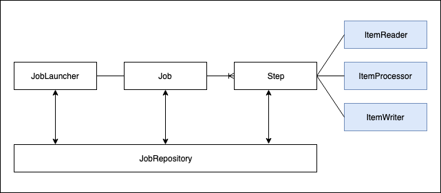

# Spring Batch Study

## 스피링 배치 구조
* Job Type의 Bean이 만들어지면 JobLauncher에 의해 Job을 실행하고, Job이 실행되면 Step이 실행됨
* JobRepository: DB 또는 메모리에 Batch가 동작할 수 있도록 Batch의 메타 데이터 관리
* Job은 배치의 실행 단위, Job은 N개의 Step으로 구성될 수 있음
* Step은 Job의 세부 실행 단위 
    * Step의 실행 단위는 2가지로 나뉨
        * Chunk: 하나의 큰 덩어리를 n개씩 나눠서 실행
        * Task: 하나의 작업 기반으로 실행
    * Chunk 기반 Step은 ItemReader, ItemProcessor, ItemWriter가 있음
        * Item은 배치 대상 객체

## Batch 메타 데이터 테이블
spring-batch-core폴더 하단 메타 데이터 테이블을 생성할 수 있는 sql문 위치
* BATCH_JOB_INSTANCE <-> JobInstance.class와 매핑
    * Job이 실행되는 최상위 계층 테이블
    * job_name과 job_key를 기준으로 하나이 row가 생성되며, 같은 job_name과 job_key가 저장될 수 없다.
    * job_key는 BATCH_JOB_EXECUTION_PARAMS에 저장된 Parameter를 나열해 암호화해 저장한다.
* BATCH_JOB_EXECUTION <-> JobExecution.class와 매핑
    * job이 실행되는 동안 시작/종료 시간, job 상태 등을 관리
* BATCH_JOB_EXECUTION_PARAMS <-> JobParameters.class
    * job이 실행되기위해 주입된 parameter 정보 저장
* BATCH_JOB_EXECUTION_CONTEXT <-> ExecutionContext.class와 매핑
    * job이 실행되며 공유해야할 데이터를 직렬화해 저장
* BATCH_STEP_EXECUTION <-> StepExecution과 매핑
    * step이 실행되는 동안 필요한 데이터 또는 실행되는 결과 저장
* BATCH_STEP_EXECUTION_CONTEXT <-> ExecutionContext와 매핑
    * step이 실행되며 공유해야할 데이터를 직렬화해 저장

## @JobScope와 @StepScore 정리
* @Scope는 어떤 시점에 bean을 생성/소멸 시킬 지 bean의 lifecycle 설정
* @JobScopr는 job 실행 시점의 생성/소멸
    * step에 선언
* @StepScope는 step 실행 시점의 생성/소멸
    * Tasklet, Chunk의 ItemReader, ItemProcessor, ItemWriter에 선언
* Job과 Step 라이프사이클에 의해 생성되기 때문에 Thread Safe하게 동작

## Chunk
* ItemReader: batch 처리할 데이터를 하나씩 읽어 드림
* ItemProcessor: 데이터 추가 처리 / writer로 전송여부 판단
* ItemWriter: 마지막에 모아서 실행

## Job 스케줄링하여 실행
* JobLauncher를 이용하여 지정한 스케줄에따라 batch job 실행
* @Scheduled 속성
    * fixedDelay : 작업이 끝난 시점 기준, milliseconds 마다 동작
    * fixedDelayString : fixedDelay와 동일, 속성값만 String으로 입력
    * fixedRate : 작업이 시작한 시점 기준, milliseconds 마다 동작
    * fixedRateString : fixedRate와 동일, 속성값만 String으로 입력
    * initialDelay : 최초 수행 지연 시간, milliseconds 이후에 실행
    * initialDelayString : initialDelay와 동일, 속성값만 String으로 입력
* cron 속성
    * 초: 0~59
    * 분: 0~59
    * 시: 0~23
    * 일: 1~31
    * 월: 1~12 혹은 JAN FEB MAR APR MAY JUN JUL AUG SEP OCT NOV DEC
    * 요일: 1~7 혹은 SUN MON TUE WED THU FRI SAT

## 코드
* spring-batch-example 프로젝트 참조

### TODO
* Quartz를 사용한 스켈줄링
* ...